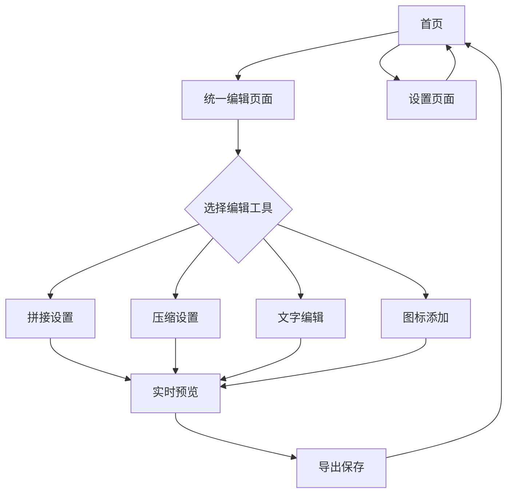

# 移动端图片处理工具 - 产品需求文档

## 1. 产品概述

移动端图片处理工具是一款专为移动设备优化的在线图片编辑应用，提供图片拼接、压缩和格式转换等核心功能。
该产品旨在为用户提供简单易用的图片处理解决方案，支持离线操作，无需上传图片到服务器，保护用户隐私的同时提供流畅的处理体验。
目标是成为移动端用户首选的轻量级图片处理工具，满足日常图片编辑需求。

## 2. 核心功能

### 2.1 用户角色
本产品为单用户应用，无需注册登录，所有功能对用户开放。

### 2.2 功能模块
我们的移动端图片处理工具包含以下主要页面：
1. **首页**：功能导航、快速操作入口、最近处理记录
2. **统一编辑页面**：集成图片拼接、压缩、文字叠加、图标添加、导出等所有功能
3. **设置页面**：应用设置、导出偏好、缓存管理

### 2.3 页面详情

| 页面名称 | 模块名称 | 功能描述 |
|---------|---------|---------|
| 首页 | 功能导航 | 显示"开始编辑"主要功能入口，采用卡片式布局 |
| 首页 | 快速操作 | 提供"选择图片"快捷按钮，支持相机拍照和相册选择 |
| 首页 | 最近记录 | 展示最近处理的图片缩略图和操作类型，支持快速重新编辑 |
| 统一编辑页面 | 图片管理区 | 支持多选图片，显示选中图片预览，支持拖拽排序和删除 |
| 统一编辑页面 | 画布预览区 | 实时显示编辑效果，支持手势缩放、平移查看细节 |
| 统一编辑页面 | 工具栏 | 底部工具栏包含：拼接、压缩、文字、图标、导出等功能按钮 |
| 统一编辑页面 | 拼接设置面板 | 横向/纵向拼接选项、间距调整、对齐方式、背景颜色设置 |
| 统一编辑页面 | 压缩设置面板 | 质量压缩滑块(0-100%)、尺寸调整选项、批量处理开关 |
| 统一编辑页面 | 文字编辑面板 | 文字输入框、字体选择、大小调整、颜色选择、位置拖拽 |
| 统一编辑页面 | 图标添加面板 | 图标库选择、大小调整、颜色设置、透明度调整、位置拖拽 |
| 统一编辑页面 | 导出设置面板 | 格式选择(JPG/PNG/WEBP)、分辨率设置、元数据选项、保存到相册 |
| 设置页面 | 应用设置 | 默认导出格式、图片质量偏好、自动保存设置 |
| 设置页面 | 缓存管理 | 显示缓存大小、清理临时文件、处理历史管理 |

## 3. 核心流程

**主要用户操作流程：**

统一编辑流程：用户从首页进入编辑功能 → 选择图片(单张/多张) → 在统一界面中进行各种编辑操作：
- 图片拼接：设置拼接方向、间距、对齐方式
- 图片压缩：调整质量、尺寸参数
- 文字叠加：添加文字、设置字体、颜色、位置
- 图标添加：选择图标、调整大小、颜色、位置
- 实时预览：查看所有编辑效果
- 导出保存：选择格式、分辨率、保存到相册

## 4. 用户界面设计

### 4.1 设计风格
- **主色调**：#3B82F6 (蓝色) 作为主色，#10B981 (绿色) 作为成功状态色
- **辅助色**：#6B7280 (灰色) 用于次要文本，#EF4444 (红色) 用于警告状态
- **按钮样式**：圆角按钮设计，主要按钮采用渐变效果，次要按钮使用边框样式
- **字体**：系统默认字体，标题使用16-20px，正文使用14-16px，说明文字使用12-14px
- **布局风格**：卡片式布局，顶部导航栏，底部操作区域固定
- **图标风格**：使用线性图标风格，简洁明了，支持深色模式适配

### 4.2 页面设计概览

| 页面名称 | 模块名称 | UI元素 |
|---------|---------|--------|
| 首页 | 功能导航 | 三个大型功能卡片，渐变背景，图标+文字布局，卡片阴影效果 |
| 首页 | 快速操作 | 浮动操作按钮(FAB)，位于右下角，蓝色渐变，相机图标 |
| 首页 | 最近记录 | 横向滚动的图片缩略图列表，圆角边框，操作标签 |
| 图片拼接页面 | 图片选择器 | 网格布局的图片预览，选中状态蓝色边框，拖拽排序指示器 |
| 图片拼接页面 | 拼接设置 | 分段控制器选择方向，滑块调整间距，对齐按钮组 |
| 图片拼接页面 | 实时预览 | 居中显示的预览区域，支持手势缩放，加载动画效果 |
| 图片压缩页面 | 压缩设置 | 质量滑块带实时数值显示，尺寸输入框，压缩算法选择器 |
| 图片压缩页面 | 效果对比 | 左右分屏对比视图，文件大小标签，压缩比例进度条 |
| 设置页面 | 应用设置 | 列表式设置项，开关控件，选择器弹窗 |

### 4.3 响应式设计
产品采用移动端优先设计，专为触控操作优化。支持iOS和Android系统的原生手势操作，包括双指缩放、滑动导航等。界面元素按照44px最小触控区域设计，确保良好的可操作性。支持横竖屏自适应，在横屏模式下优化布局以充分利用屏幕空间。