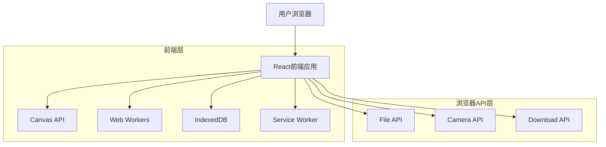
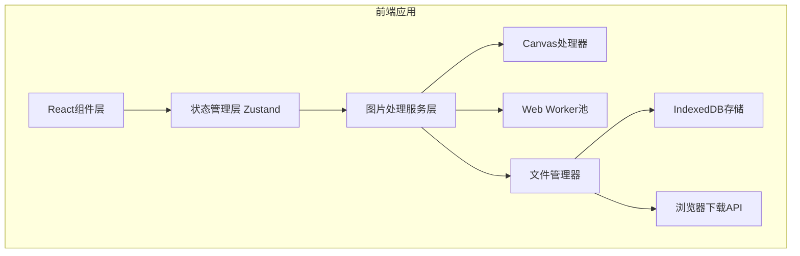
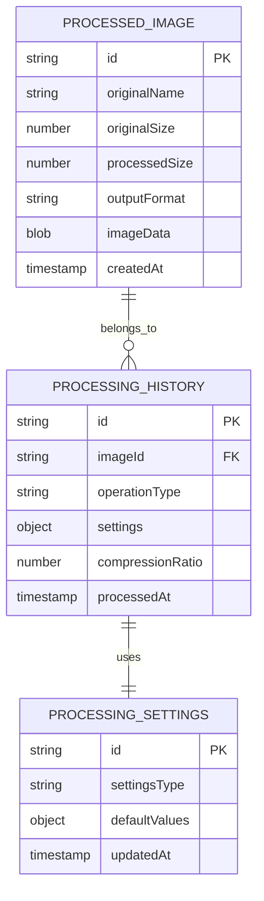

# 移动端图片处理工具 - 技术架构文档

## 1. 架构设计



## 2. 技术描述

- **前端**: React@18 + TypeScript@5 + Vite@5 + Tailwind CSS@3
- **图片处理**: Canvas API + Web Workers + OffscreenCanvas
- **状态管理**: Zustand@4
- **UI组件**: Headless UI + Radix UI
- **手势操作**: @use-gesture/react
- **本地存储**: IndexedDB (Dexie.js)
- **离线支持**: Service Worker + Workbox
- **构建工具**: Vite + PWA Plugin

## 3. 路由定义

| 路由 | 用途 |
|------|-----|
| / | 首页，显示主要功能入口和最近处理记录 |
| /splice | 图片拼接页面，提供多图拼接功能 |
| /compress | 图片压缩页面，提供压缩和尺寸调整功能 |
| /settings | 设置页面，应用配置和缓存管理 |

## 4. API定义

### 4.1 核心图片处理API

图片拼接处理
```typescript
interface SpliceOptions {
  direction: 'horizontal' | 'vertical';
  spacing: number;
  alignment: 'start' | 'center' | 'end';
  backgroundColor: string;
  borderRadius: number;
}

interface SpliceImageParams {
  images: File[];
  options: SpliceOptions;
  outputFormat: 'jpeg' | 'png' | 'webp';
  quality: number;
}
```

图片压缩处理
```typescript
interface CompressOptions {
  quality: number; // 0-100
  maxWidth?: number;
  maxHeight?: number;
  maintainAspectRatio: boolean;
  outputFormat: 'jpeg' | 'png' | 'webp';
}

interface CompressImageParams {
  image: File;
  options: CompressOptions;
}
```

批量处理
```typescript
interface BatchProcessParams {
  images: File[];
  operation: 'compress' | 'splice';
  options: CompressOptions | SpliceOptions;
  onProgress: (progress: number, currentIndex: number) => void;
}
```

## 5. 服务架构图



## 6. 数据模型

### 6.1 数据模型定义



### 6.2 数据定义语言

图片处理记录表 (processed_images)
```typescript
// IndexedDB Schema
interface ProcessedImage {
  id: string; // UUID
  originalName: string;
  originalSize: number; // bytes
  processedSize: number; // bytes
  outputFormat: 'jpeg' | 'png' | 'webp';
  imageData: Blob;
  thumbnail: Blob; // 缩略图
  createdAt: Date;
}

// 创建IndexedDB存储
const db = new Dexie('ImageProcessorDB');
db.version(1).stores({
  processedImages: 'id, originalName, createdAt',
  processingHistory: 'id, imageId, operationType, processedAt',
  userSettings: 'key'
});
```

处理历史表 (processing_history)
```typescript
interface ProcessingHistory {
  id: string;
  imageId: string; // 关联processed_images.id
  operationType: 'compress' | 'splice' | 'convert';
  settings: CompressOptions | SpliceOptions;
  compressionRatio?: number; // 压缩比例
  processedAt: Date;
}
```

用户设置表 (user_settings)
```typescript
interface UserSettings {
  key: string; // 设置键名
  value: any; // 设置值
  updatedAt: Date;
}

// 默认设置
const defaultSettings = {
  defaultOutputFormat: 'jpeg',
  defaultQuality: 80,
  autoSaveToGallery: true,
  maxCacheSize: 100, // MB
  enableOfflineMode: true
};
```

## 7. 移动端适配策略

### 7.1 响应式设计
- 采用Tailwind CSS的响应式断点系统
- 使用CSS Grid和Flexbox实现弹性布局
- 视口单位(vw, vh)确保在不同屏幕尺寸下的适配

### 7.2 触控优化
- 最小触控区域44px×44px
- 手势操作支持：双指缩放、滑动、长按
- 触觉反馈集成(Vibration API)

### 7.3 性能优化
- 图片处理使用Web Workers避免主线程阻塞
- OffscreenCanvas提升Canvas性能
- 虚拟滚动处理大量图片列表
- 图片懒加载和预加载策略

## 8. 离线支持方案

### 8.1 Service Worker配置
```typescript
// 缓存策略
const cacheStrategy = {
  static: 'cache-first', // 静态资源
  api: 'network-first',  // API请求
  images: 'cache-first'  // 处理后的图片
};
```

### 8.2 本地存储策略
- 使用IndexedDB存储处理后的图片和设置
- 实现LRU缓存清理机制
- 支持离线状态下的完整图片处理功能